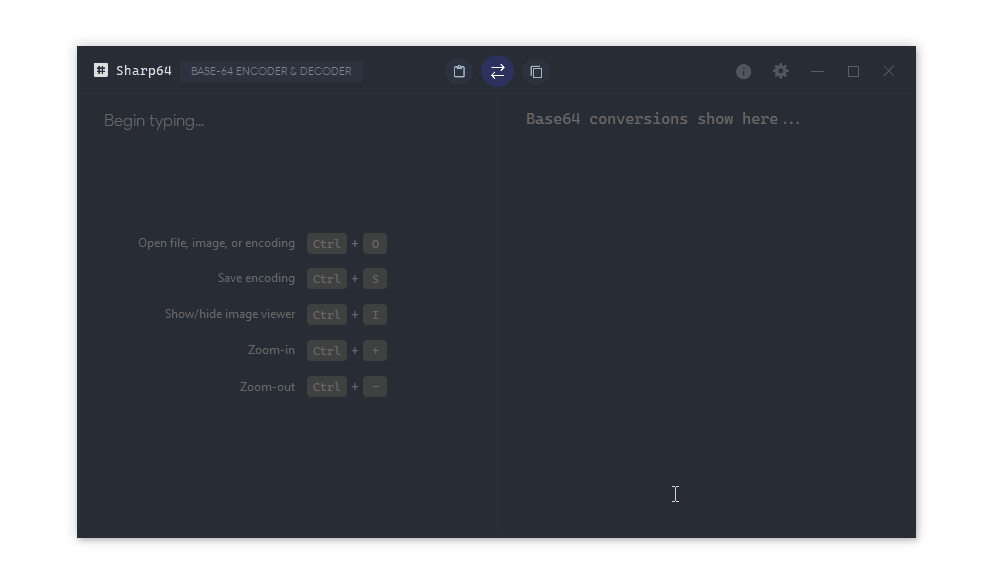
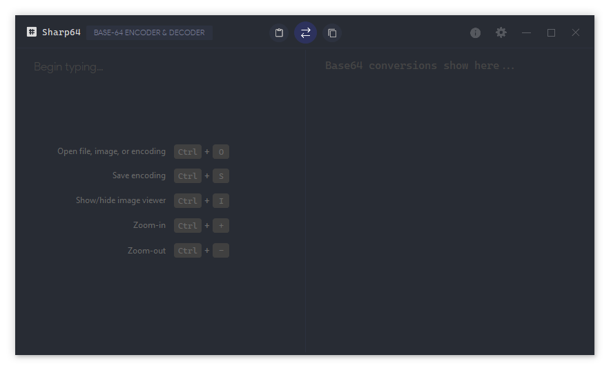
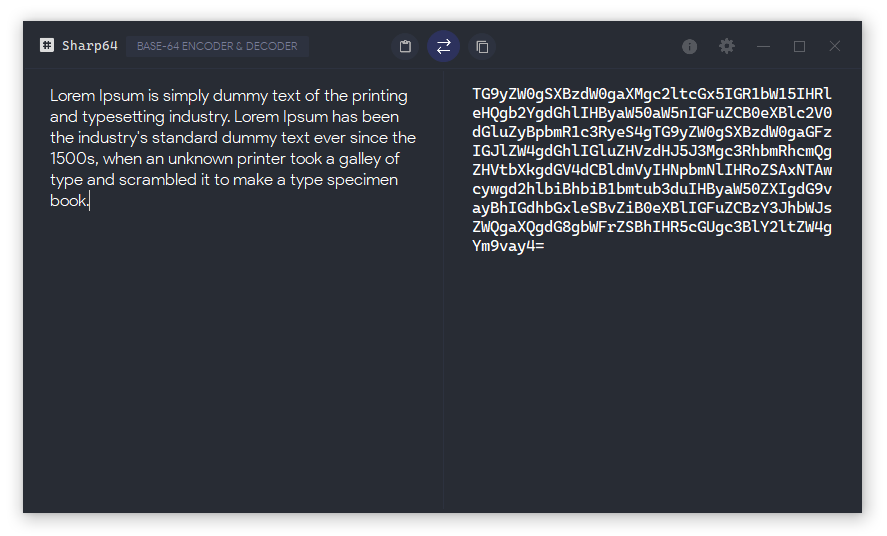
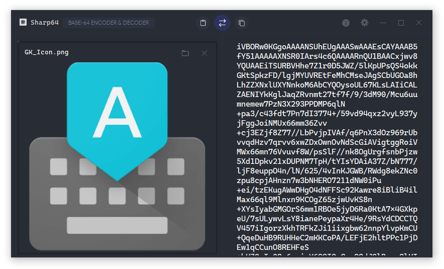
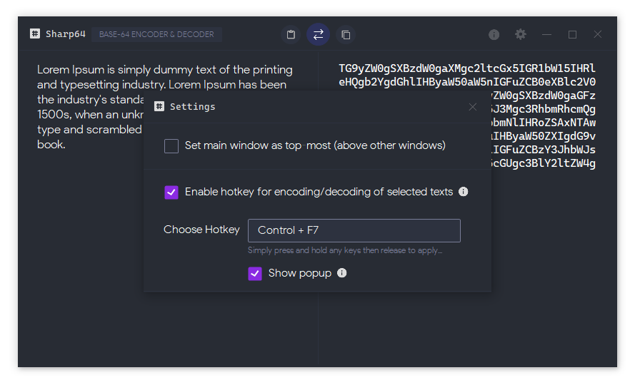
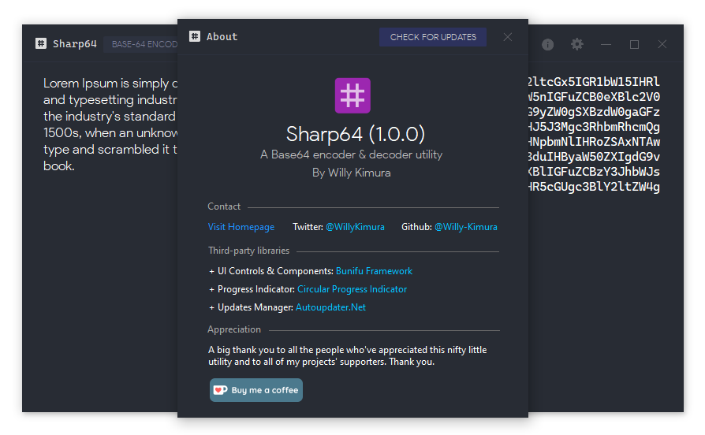

# Sharp64 - Base64 Encoder/Decoder

**Sharp64** is a beautiful .NET utility that provides [Base64]( https://en.wikipedia.org/wiki/Base64 ) encoding/decoding for texts, files, and images.

- *Startup Window*

- *Text Encoding*

- *Image Encoding*

- *Settings Window*

- *About Window*

# Features

- Minimalist design.

- Encodes/decodes texts, files, and images.

- Can save encodings as files - Text encodings (.*enc*), Image encodings (.*enci*)

- Allows encoding/decoding of texts from any application/website using a customizable hotkey.

- Provides shortcut keys for priority features e.g. *Saving encodings*.

  > Available Shortcuts:
  >
  > | Hotkeys    | Function                 |
  > | ---------- | ------------------------ |
  > | `Ctrl`+`O` | Opens files & encodings  |
  > | `Ctrl`+`S` | Saves an encoding        |
  > | `Ctrl`+`I` | Shows/hides Image Viewer |
  > | `Ctrl` `+` | Zoom-in text             |
  > | `Ctrl` `-` | Zoom-out text            |
  > | `Escape`   | Minimizes window         |

- Provides inbuilt settings you can utilize for saving users' preferences.

- Default app icon, libraries, and other resources are included.

# Requirements

To build the project, you'll need:

- [Visual Studio 2012](https://visualstudio.microsoft.com/downloads/) or higher.
- A [Bunifu UI](https://bunifuframework.com/ref/Willy) license. (*Use the discount code [WK20]( https://bunifuframework.com/pricing) to get a 20% discount offer!*)
- Install the fonts:
  - [Product Sans](https://befonts.com/product-sans-font.html)
  - [Cascadia Code]( https://github.com/microsoft/cascadia-code/releases )

The project targets Microsoft [.NET Framework 4.5.2](https://www.microsoft.com/en-us/download/details.aspx?id=42642).

*Made with* 💛 *by* [*Willy Kimura*]([https://github.com/Willy-Kimura).